The main goal of this code base is to Create a Graph out of HashTags from tweets coming in from live streaming API of Twitter. It also calculates the average degree of each Node(or HashTag) over a 60-second sliding window.

To run the script use the shell script run.sh or run the python script average_degree.py with following syntax.

python ./src/average_degree.py ./tweet_input/tweets.txt ./tweet_output/output.txt

Dependencies: networkx python package. 

Other python packages used: json, datetime, sys

Insight Data Engineering - Coding Challenge
===========================================================

# Table of Contents
1. [Summary](README.md#summary)
2. [Details of Implementation](README.md#details-of-implementation)
3. [Building the Twitter Hashtag Graph](README.md#building-the-twitter-hashtag-graph)
4. [Modifying the Twitter Hashtag Graph with Incoming Tweet](README.md#modifying-the-twitter-hashtag-graph-with-incoming-tweet)
5. [Maintaining Data within the 60 Second Window](README.md#maintaining-data-within-the-60-second-window)
6. [Dealing with tweets which arrive out of order in time](README.md#dealing-with-tweets-which-arrive-out-of-order-in-time)


## Summary
[Back to Table of Contents](README.md#table-of-contents)

Calculate the average degree of a vertex in a Twitter hashtag graph for the last 60 seconds, and update this each time a new tweet appears. Thus it will calculate the average degree over a 60-second sliding window.

To clarify, a Twitter hashtag graph is a graph connecting all the hashtags that have been mentioned together in a single tweet.  Examples of Twitter hashtags graphs are below.

## Details of Implementation
[Back to Table of Contents](README.md#table-of-contents)

The file `tweets.txt` will contain the actual JSON messages (and the messages emitted by the API about the connection and rate limits, which need to be properly removed from calculations).  `tweets.txt` will have the content of each tweet on a newline:

`tweets.txt`: 

	{JSON of first tweet}  
	{JSON of second tweet}  
	{JSON of third tweet}  
	.
	.
	.
	{JSON of last tweet}  

One example of the data for a single Tweet might look like:

<pre>
{<b>"created_at":"Fri Oct 30 15:29:45 +0000 2015"</b>,"id":660116384450347008,
"id_str":"660116384450347008","text":"We're #hiring! Click to apply: SMB Analyst - https:\/\/t.co\/lAy8j01BkE #BusinessMgmt #NettempsJobs #MenloPark, CA #Job #Jobs #CareerArc",
"source":"\u003ca href=\"http:\/\/www.tweetmyjobs.com\" rel=\"nofollow\"\u003eTweetMyJOBS\u003c\/a\u003e","truncated":false,"in_reply_to_status_id":null,"in_reply_to_status_id_str":null,"in_reply_to_user_id":null,
"in_reply_to_user_id_str":null,"in_reply_to_screen_name":null,"user":{"id":24315640,"id_str":"24315640","name":"TMJ-SJC Mgmt. Jobs","screen_name":"tmj_sjc_mgmt","location":"San Jose, CA","url":"http:\/\/tweetmyjobs.com",
"description":"Follow this account for geo-targeted Business\/Mgmt. job tweets in San Jose, CA from TweetMyJobs. Need help? Tweet us at @TweetMyJobs!","protected":false,"verified":false,"followers_count":389,
"friends_count":256,"listed_count":23,"favourites_count":0,"statuses_count":422,"created_at":"Sat Mar 14 02:57:56 +0000 2009","utc_offset":-14400,"time_zone":"Eastern Time (US & Canada)",
"geo_enabled":true,"lang":"en","contributors_enabled":false,"is_translator":false,"profile_background_color":"253956",
"profile_background_image_url":"http:\/\/pbs.twimg.com\/profile_background_images\/315515499\/Twitter-BG_2_bg-image.jpg",
"profile_background_image_url_https":"https:\/\/pbs.twimg.com\/profile_background_images\/315515499\/Twitter-BG_2_bg-image.jpg","profile_background_tile":false,"profile_link_color":"96BEDF",
"profile_sidebar_border_color":"000000","profile_sidebar_fill_color":"407DB0","profile_text_color":"000000",
"profile_use_background_image":true,"profile_image_url":"http:\/\/pbs.twimg.com\/profile_images\/2303732039\/Logo_tmj_new2b_normal.png",
"profile_image_url_https":"https:\/\/pbs.twimg.com\/profile_images\/2303732039\/Logo_tmj_new2b_normal.png","profile_banner_url":"https:\/\/pbs.twimg.com\/profile_banners\/24315640\/1349361844",
"default_profile":false,"default_profile_image":false,"following":null,"follow_request_sent":null,"notifications":null},"geo":{"type":"Point","coordinates":[37.4484914,-122.1802812]},"coordinates":{"type":"Point","coordinates":[-122.1802812,37.4484914]},"place":{"id":"490bdb082950484f",
"url":"https:\/\/api.twitter.com\/1.1\/geo\/id\/490bdb082950484f.json","place_type":"city","name":"Menlo Park","full_name":"Menlo Park, CA",
"country_code":"US","country":"United States","bounding_box":{"type":"Polygon","coordinates":[[[-122.228635,37.416515],[-122.228635,37.507328],[-122.120415,37.507328],[-122.120415,37.416515]]]},
"attributes":{}},"contributors":null,"is_quote_status":false,"retweet_count":0,"favorite_count":0,
"entities":{<b>"hashtags":[{"text":"hiring","indices":[6,13]},{"text":"BusinessMgmt","indices":[69,82]},{"text":"NettempsJobs","indices":[83,96]},{"text":"MenloPark","indices":[97,107]},
{"text":"Job","indices":[112,116]},{"text":"Jobs","indices":[117,122]},{"text":"CareerArc","indices":[123,133]}]</b>,"urls":[{"url":"https:\/\/t.co\/lAy8j01BkE",
"expanded_url":"http:\/\/bit.ly\/1XEF1ja","display_url":"bit.ly\/1XEF1ja","indices":[45,68]}],"user_mentions":[],"symbols":[]},"favorited":false,"retweeted":false,"possibly_sensitive":false,"filter_level":"low","lang":"en",
"timestamp_ms":"1446218985079"}

</pre>

Although this contains a lot of information, you will only need the **hashtags** and **created_at** fields of each entry, which are in bold in the above entry.

You will update the Twitter hashtag graph each time you process a new tweet and hence, the average degree of the graph. The graph should only consist of tweets that arrived in the last 60 seconds as compared to the maximum timestamp that has been processed. 

As new tweets come in, edges formed with tweets older than 60 seconds from the maximum timestamp being processed should be evicted. For each incoming tweet, only extract the following fields from the JSON response

Although the hashtags also appear in the "text" field, there is no need to go through the effort of extracting the hashtags from that field since there already is a "hashtags" field.  Similarly, although there is a "timestamp\_ms" field, please only use the "created\_at" field.

## Building the Twitter Hashtag Graph
[Back to Table of Contents](README.md#table-of-contents)

Here is an example of the extracted information from 4 tweets:

```
hashtags = [Spark , Apache],        created_at: Thu Mar 24 17:51:10 +0000 2016
hashtags = [Apache, Hadoop, Storm], created_at: Thu Mar 24 17:51:15 +0000 2016
hashtags = [Apache],                created_at: Thu Mar 24 17:51:30 +0000 2016
hashtags = [Flink, Spark],          created_at: Thu Mar 24 17:51:55 +0000 2016
```

Two hashtags will be connected if and only if they are present in the same tweet. Only tweets that contain two or more **DISTINCT** hashtags can create new edges.

**NOTE:** The order of the tweets coming in **might not be ordered by time** (we'll see an example below on how to deal with tweets which are out of order in time), which mimics what one would get from Twitter's streaming API. 

A good way to create this graph is with an edge list where an edge is defined by two hashtags that are connected.

In this case, the first tweet that enters the system has a timestamp of `Thu Mar 24 17:51:10 +0000 2016` and the edge formed is 

```
Spark <-> Apache
```


The average degree will be calculated by summing the degrees of both nodes in the graph and dividing by the total number of nodes in the graph.

Average Degree = (1+1) / 2 = 1.00

The rolling average degree output is

```
1.00
```
The second tweet is in order and it will form new edges in the graph.

The edge list by first two tweets are:

```
#Spark <-> #Apache

#Apache <-> #Hadoop
#Hadoop <-> #Storm 
#Storm <-> #Apache
```

The second tweet contains 3 hashtags `#Apache`, `#Hadoop`, and `#Storm`. `#Apache` already exists in the graph, so only `#Hadoop` and `#Storm` are added to the graph and the graph now is:

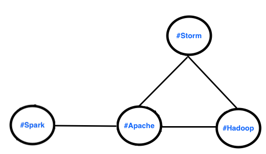

Average Degree = (1+3+2+2) / 4 = 2.00

The rolling average degree output is

```
1.00
2.00
```

The third tweet has only one hashtag and hence, it doesn't generate any edges, so no new nodes will be added to the graph. The rolling average degree output is:

```
1.00
2.00
2.00
```

The fourth tweet is in order of time and forms new edges. The edges in the graph  are:

```
#Spark <-> #Apache

#Apache <-> #Hadoop
#Hadoop <-> #Storm
#Storm <-> #Apache

#Flink <-> #Spark
```
The fourth tweet contains `#Flink` and `#Spark`. `#Spark` already exists, so only `#Flink` will be added.

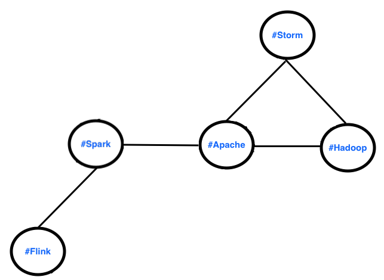

We can now calculate the degree of each node which is defined as the number of connected neighboring nodes.

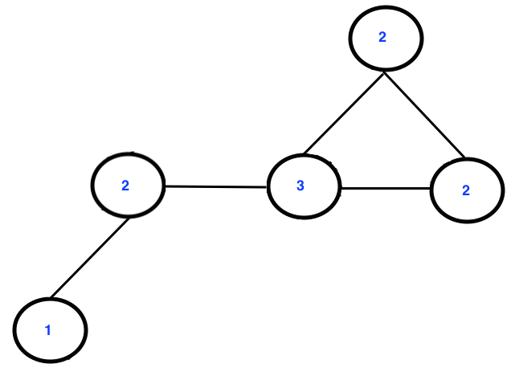

Average Degree = (1+2+3+2+2) / 5 = 2.00

The rolling average degree output at the end of fourth tweet is

```
1.00
2.00
2.00
2.00
```
Note that all the tweets are in order of time in this example and for every incoming tweet, all the old tweets are in the 60 second window of the timestamp of the latest incoming tweet and hence, no tweets are evicted (we'll see an example below on how the edge eviction should be handled with time).

## Modifying the Twitter Hashtag Graph with Incoming Tweet
[Back to Table of Contents](README.md#table-of-contents)

Now let's say another tweet has arrived and the extracted information is

```
hashtags = [Spark , HBase], created_at: Thu Mar 24 17:51:58 +0000 2016
```

The edge list now becomes:

```
#Spark <-> #Apache

#Apache <-> #Hadoop
#Hadoop <-> #Storm
#Storm <-> #Apache

#Flink <-> #Spark

#HBase <-> $Spark
```

The graph now looks like the following

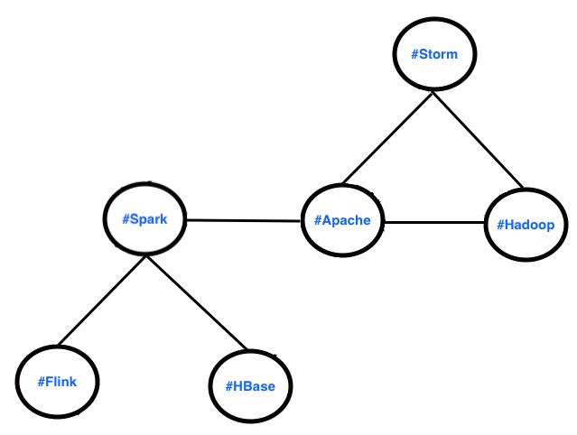

The updated degree calculation for each node is as follow. Here only `#Spark` needs to be incremented due to the additional `#HBase` node.

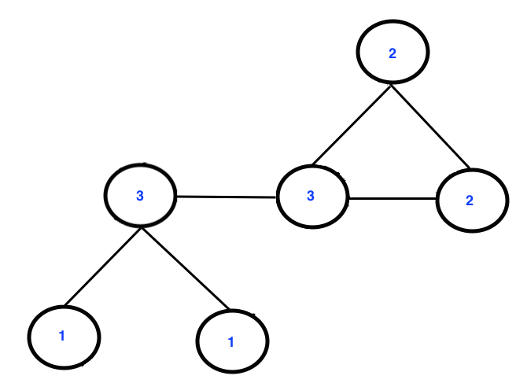

The average degree will be recalculated using the same formula as before.

Average Degree = (1+3+1+3+2+2) / 6 = 2.00

The rolling average degree is

```
1.00
2.00
2.00
2.00
2.00
```

## Maintaining Data within the 60 Second Window
[Back to Table of Contents](README.md#table-of-contents)

Now let's say that the next tweet comes in and the extracted information is 

```
hashtags = [Hadoop, Apache], created_at: Thu Mar 24 17:52:12 +0000 2016
```

Extracted information from all the tweets is

```
hashtags = [Spark , Apache],        created_at: Thu Mar 24 17:51:10 +0000 2016
hashtags = [Apache, Hadoop, Storm], created_at: Thu Mar 24 17:51:15 +0000 2016
hashtags = [Apache],                created_at: Thu Mar 24 17:51:30 +0000 2016
hashtags = [Flink, Spark],          created_at: Thu Mar 24 17:51:55 +0000 2016
hashtags = [Spark , HBase],         created_at: Thu Mar 24 17:51:58 +0000 2016
hashtags = [Hadoop, Apache],        created_at: Thu Mar 24 17:52:12 +0000 2016
```

We can see that the very first tweet has a timestamp that is more than 60 seconds behind this new tweet. This means that the edges formed by the first tweet should be evicted and the first tweet should not be included in our average degree calculation.

The new hashtags to be used in constructing the graph are as follows

```
hashtags = [Apache, Hadoop, Storm], created_at: Thu Mar 24 17:51:15 +0000 2016
hashtags = [Apache],                created_at: Thu Mar 24 17:51:30 +0000 2016
hashtags = [Flink, Spark],          created_at: Thu Mar 24 17:51:55 +0000 2016
hashtags = [Spark , HBase],         created_at: Thu Mar 24 17:51:58 +0000 2016
hashtags = [Hadoop, Apache],        created_at: Thu Mar 24 17:52:12 +0000 2016
```

The new edge list only has the `#Spark` <-> `#Apache` edge removed. The edge `#Hadoop` <-> `#Apache` from the new tweet already exists in the edge list.

```
#Apache <-> #Hadoop
#Hadoop <-> #Storm
#Storm <-> #Apache

#Flink <-> #Spark

#HBase <-> $Spark
```

The old graph has now been disconnected forming two graphs.

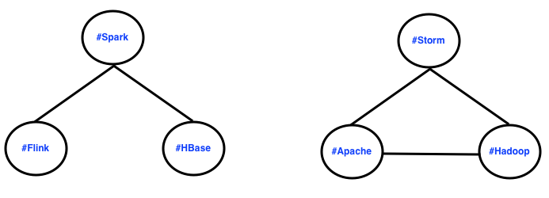

We'll then calculate the new degree for all the nodes in both graphs.

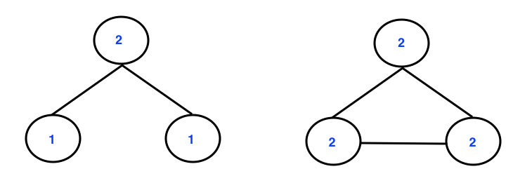

Recalculating the average degree of all nodes in all graphs is as follows

```
Average Degree = (1+2+1+2+2+2)/6 = 1.66
```

Normally the average degree is calculated for a single graph, but maintaining multiple graphs for this problem can be quite difficult. For simplicity, we are only interested in calculating the average degree of of all the nodes in all graphs despite them being disconnected.

The rolling average degree now becomes

```
1.00
2.00
2.00
2.00
2.00
1.66
```

## Dealing with tweets which arrive out of order in time
[Back to Table of Contents](README.md#table-of-contents)

Tweets which are out of order and fall within the 60 sec window of the maximum timestamp processed or in other words, are less than 60 sec older than the maximum timestamp being processed, will create new edges in the graph. However, tweets which are out of order in time and are outside the 60-second window of the maximum timestamp processed (or more than 60 seconds older than the maximum timestamp being processed) should be ignored and such tweets won't contribute to building the graph.  Below is a diagram showing this, with the Nth tweet corresponding to the tweet on the the Nth line of the `tweets.txt` file.

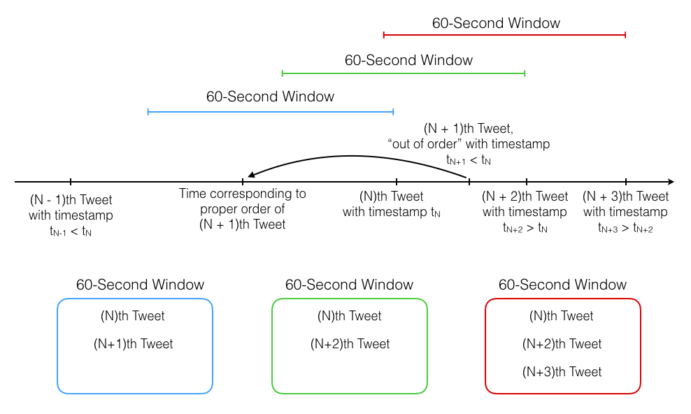

It's easiest to understand this with an example.  Let's say that a new tweet comes in and the extracted information is

```
hashtags = [Flink, HBase], created_at: Thu Mar 24 17:52:10 +0000 2016
```
This tweet is out of order in time but falls within the 60 second time window of the maximum timestamp processed (latest timestamp), i.e., `Thu Mar 24 17:52:12 +0000 2016`.

The new hashtags to be used in constructing the graph are as follows

```
hashtags = [Apache, Hadoop, Storm], created_at: Thu Mar 24 17:51:15 +0000 2016
hashtags = [Apache],                created_at: Thu Mar 24 17:51:30 +0000 2016
hashtags = [Flink, Spark],          created_at: Thu Mar 24 17:51:55 +0000 2016
hashtags = [Spark , HBase],         created_at: Thu Mar 24 17:51:58 +0000 2016
hashtags = [Hadoop, Apache],        created_at: Thu Mar 24 17:52:12 +0000 2016
hashtags = [Flink, HBase],          created_at: Thu Mar 24 17:52:10 +0000 2016
```

A new edge is added to the graph and the edge list becomes

```
#Apache <-> #Hadoop
#Hadoop <-> #Storm
#Storm <-> #Apache

#Flink <-> #Spark

#HBase <-> $Spark

#HBase <-> #Flink
``` 
The graph can be visualized as

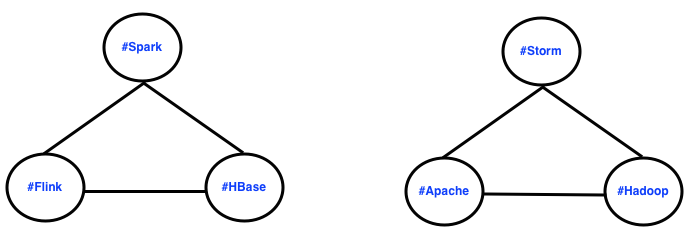

```
The average degree is (2+2+2+2+2+2) / 6 = 2.00
```

The rolling average degree output becomes

```
1.00
2.00
2.00
2.00
2.00
1.66
2.00
```

Now, let's say that a new tweet comes in and the extracted information is

```
hashtags = [Cassandra, NoSQL], created_at: Thu Mar 24 17:51:10 +0000 2016
```
This tweet is out of order and is outside the 60 second window of the maximum timestamp processed (latest timestamp),  i.e., `Thu Mar 24 17:52:12 +0000 2016`. This tweet should be ignored. It will not form new edges and will not contribute to the graph formation. The graph remains the same as before this tweet arrived.

Consider that a new tweet arrives and the extracted information is

```
hashtags = [Kafka, Apache], created_at: Thu Mar 24 17:52:20 +0000 2016
```

We can see that the tweet with hashtags `[Apache, Hadoop, Storm]` has a timestamp that is more than 60 seconds behind this new tweet. This means that the edges formed by the tweet 60 seconds behind the maximum timestamp processed (latest timestamp) should be evicted and the edges formed by that should not be included in our average degree calculation.

The new hashtags to be used in constructing the graph are as follows

```
hashtags = [Apache],                created_at: Thu Mar 24 17:51:30 +0000 2016
hashtags = [Flink, Spark],          created_at: Thu Mar 24 17:51:55 +0000 2016
hashtags = [Spark , HBase],         created_at: Thu Mar 24 17:51:58 +0000 2016
hashtags = [Hadoop, Apache],        created_at: Thu Mar 24 17:52:12 +0000 2016
hashtags = [Flink, HBase],          created_at: Thu Mar 24 17:52:10 +0000 2016
hashtags = [Kafka, Apache],         created_at: Thu Mar 24 17:52:20 +0000 2016
```

The edge list now becomes

```
#Flink <-> #Spark

#HBase <-> $Spark

#Apache <-> #Hadoop

#HBase <-> #Flink

#Kafka <-> #Apache
```
The graph is as follows

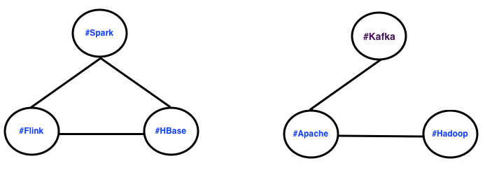

```
The average degree of the graph is (2+2+2+2+1+1) / 6 = 1.66
```
The rolling average degree output is

```
1.00
2.00
2.00
2.00
2.00
1.66
2.00
1.66
```


## Repo directory structure
[Back to Table of Contents](README.md#table-of-contents)

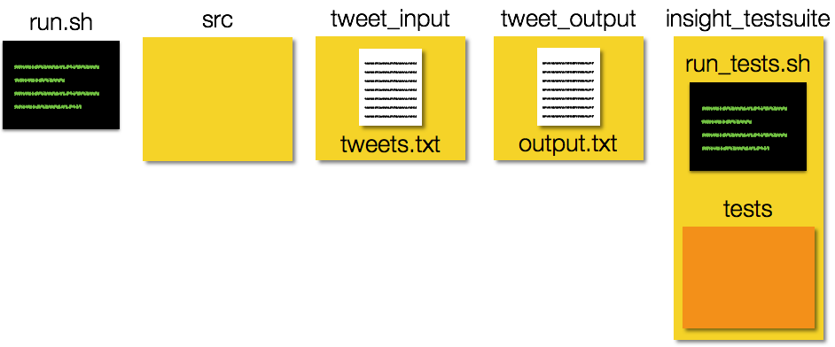

Alternatively, here is example output of the `tree` command:

	├── README.md 
	├── run.sh
	├── src
	│   └── average_degree.java
	├── tweet_input
	│   └── tweets.txt
	├── tweet_output
	│   └── output.txt
	└── insight_testsuite
	    ├── run_tests.sh
	    └── tests
	        └── test-2-tweets-all-distinct
	        │   ├── tweet_input
	        │   │   └── tweets.txt
	        │   └── tweet_output
	        │       └── output.txt
	        └── your-own-test
	            ├── tweet_input
	            │   └── tweets.txt
	            └── tweet_output
	                └── output.txt


## Testing your directory structure and output format
[Back to Table of Contents](README.md#table-of-contents)

To make sure that your code has the correct directory structure and the format of the output data in output.txt is correct, we included a test script, called `run_tests.sh` in the insight_testsuite folder.

The tests are stored simply as text files under the `insight_testsuite/tests` folder. Each test should have a separate folder and within should have a `tweet_input` folder for `tweets.txt` and a `tweet_output` folder for `output.txt` corresponding to the current test.

You can run the test with the following from the insight_testsuite folder:
```bash
insight_testsuite$ ./run_tests.sh 
```

The output of `run_tests.sh` should look like:
```bash
[FAIL]: test-2-tweets-all-distinct
[Tue Mar 29 2016 11:59:59] 0 of 1 tests passed
```
on failed tests and
```bash
[PASS]: test-2-tweets-all-distinct
[Tue Mar 29 2016 11:59:59] 1 of 1 tests passed
```
on success
